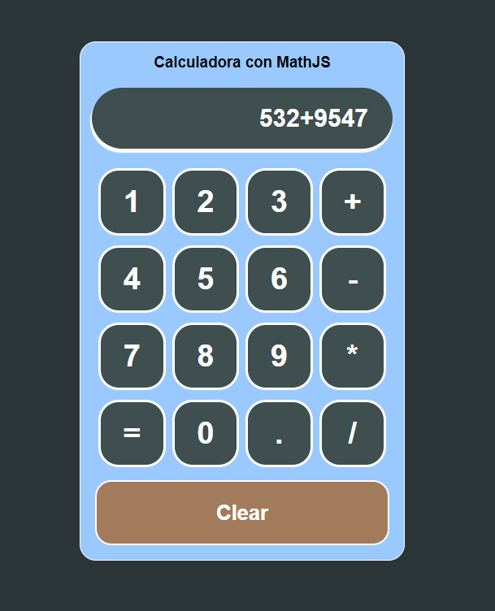

# Calculadora con React
En este proyecto se uso mathjs para evaluar expresiones para resolver las diferentes operaciones, respecto al diseño se uso conceptos de Flexbox y la división por componentes en por parte de los botones, pantalla.

Para finalizar se uso useState para manejar el estado de los valores a procesar.Las tecnologías usadas fueron:

- HTML
- CSS
- JavaScript
- React

## Capturas de la aplicación

